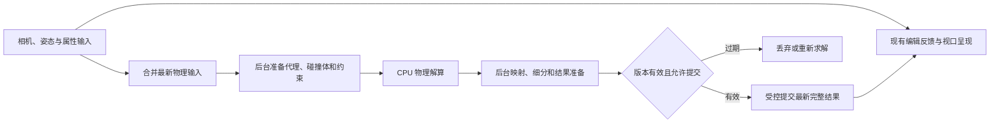

# 下一版快速物理：可行性与接入调研

日期：2026-09-28。范围：源码分析、官方资料核对、本机独立引擎编译与数值探针、已有资产只读抽查。本轮未接入产品功能，未修改或部署 `out/DazFastViewer.exe`。

后续状态：首版的后台落定设计已根据实际体验反馈替换为按角色持续小步模拟；物理 UI 也已移为独立组。本文保留最初调研记录，下面的落定建议不再代表当前方案；当前行为与边界见 [快速物理使用说明](fast_physics_usage_cn.md)，实施验证见 [验收记录](fast_physics_validation_cn.md)。

## 结论

**可以做，且与当前项目架构基本相容。** 普通刚体、固定发根的发束运动、固定腰部／肩部的衣摆与裙摆，是合理的下一版目标。物理参数可以完全独立于渲染材质。

建议第一版采用“编辑立即响应，后台自动落定，完成后延迟显示”的方式。用户停止改变姿态后，后台用游戏物理级别的约束求解，使服装／头发逐渐落定；视口继续响应相机、选择、Gizmo 和参数操作。物理暂停或计算未完成时，也必须能正常编辑。

有两个不能提前承诺的部分：

1. 任意 DAZ 服装／头发自动勾选即可获得合适效果。固定区域、网格连接、发束方向和初始穿插不一定能从资产可靠推断，需要预设与少量可修正的绑定信息。
2. 当前渲染代码直接叠加后台解算就能保证不影响交互。几何回传也有重工作，必须先完成这部分隔离和真实窗口验收。

本轮已经证明一个现成引擎能在本机编译并完成基础求解；**没有证明实际 DAZ 裙摆／发型效果或正式视口的无阻塞要求已经通过**。

## 已确认的控制范围（2026-09-28 补充）

以下按用户进一步明确的需求确定，替代此前关于角色统一管理附件开关的建议。

| 选择对象 | 是否显示“物理”组 | 启用范围与默认值 |
|---|---|---|
| 普通物体根节点 | 是 | 控制该物体；无已保存配置时默认关闭 |
| 角色本体 | 否 | 不进行角色本体的动力学模拟 |
| 每件服装／每款发型的根节点 | 是 | 各自独立控制；无已保存配置时默认关闭 |
| 角色、服装或发型内部的骨骼、几何子节点、材质表面 | 否 | 不重复出现物理组，不单独持有启用状态 |

启用服装／发型根节点后，才创建该对象所需的模拟代理、约束和后台任务。其他服装／发型继续使用原有 Morph、蒙皮和附件跟随；不因为穿在同一个角色身上而被一起启用。没有任何启用项时，物理服务不持续步进。

**角色本体不提供物理组，但可以作为碰撞依赖。** 某件穿戴物启用后，后台按需建立其宿主角色的运动学碰撞代理；它只跟随既有姿态，不反向驱动角色。多个启用附件可以共享宿主碰撞代理，最后一个依赖关闭后不再为它持续执行物理准备。一个未启用的发帽／底发仍可提供必要的挂接位置，这不代表它自身被开启动力学。

物理配置按稳定的对象根节点身份保存，不按角色、材质、网格名称或骨骼下标保存。应区分“附件根节点”和“宿主角色”：现有 `attachment_host()` 用于寻找宿主，不能直接用它作为物理配置所有者。节点为 Figure 或带骨架也不足以判定它是角色本体，需要结合现有对象元数据、附件关系及角色识别逻辑。

多组件发型按实际资产根节点划分控制范围：有明确共同发型根节点的资产，由该根控制其内部组件；多个独立组件根分别挂在角色下时，各自提供开关，不根据同名产品或同一宿主自动合并。普通场景分组不因此变成物理所有者；后续如增加整款发型的批量操作，应另外定义，不能隐式扩大本次启用范围。

只读检查现有 `H:/g1/Scenes/test9.duf`：`Mega Updo Hair Base Genesis 8 Female`、`Bangs 5`、`Bangs 2`、`Bun 5` 四个组件的 `parent` 与 `conform_target` 均直接指向 `Genesis8_1Female`，没有共同的发型父节点。因此在这个场景中，四个根分别控制，允许只开启刘海而保留底发／发髻的原有跟随。此结论针对已检查场景，不假定所有 Mega Updo 保存方式都相同。

## 项目现状与接入位置

| 现有能力 | 源码入口 | 对物理接入的意义 |
|---|---|---|
| Windows x64、C++20、MSVC、CMake、Qt，独立 Cycles | `CMakeLists.txt` | 可以直接集成 C++ CPU 物理库，不需要启动 DAZ 或 Blender |
| Morph、ERC/JCM、蒙皮、Fit To、碰撞修正、表面跟随、GeoGraft、Shell | `src/runtime/deformation.cpp:139`、`conform.h` | 已经有角色当前姿态和穿戴物位置；物理可以作为后续变形层 |
| LBS 与双四元数蒙皮、关节权重 | `src/runtime/skeleton.h` | 可以获取附件锚点和身体碰撞代理，不能简单换成物理引擎自己的蒙皮 |
| 网格和发丝曲线共用基础位置索引 | `src/render_ir/scene.h`、`src/daz/loader.cpp:792` | 同一结果通道可以驱动网格头发与真实曲线头发 |
| 拓扑不变的顶点／对象矩阵 Delta | `src/cycles/adapter.cpp:275` | 刚体主要更新矩阵；布料／头发更新顶点，不应重建整个场景 |
| 独立渲染线程、相机邮箱、编辑合并队列 | `src/editor/renderer.cpp`、`render_edit_queue.h` | 已有交互优先的基础，但不是完整的异步物理提交系统 |
| 生长／重量扩展组、后台测量服务 | `src/editor/extension_panel.cpp`、`object_extension.h` | 可以沿用属性分组样式和服务组织方式 |
| Snapshot、DUFEX、撤销、恢复点 | `src/editor/document.h`、`scene_extension.cpp`、`edit_history.cpp` | 物理配置可以持久化，模拟状态需要与用户编辑历史分开 |
| 项目设置分页 | `src/editor/project.cpp:63` | 新增“物理”页的 UI 工作相对直接 |

当前 `CollisionRuntime` 是蒙皮后的静态穿插修正，没有速度、时间积分、布料拉伸／弯曲或发束动力学，不能当作现成的物理系统。Loader 也明确提示尚未复现 dForce 模拟和额外发丝生成。

内部几何为**米、右手系、Z 向上**；DAZ 输入是厘米、Y 向上，转换为 `(x, -z, y) / 100`。因此用户所说的虚拟 `y=0` 地面，在内部应是 `z=0`，重力为 `(0, 0, -9.81)`。建议界面写“虚拟地面（高度 0）”，高度按现有用户坐标解释。现有“测量单位倍率”只改变测量显示，不应因此改变物理长度或重力。

## “绝不阻塞实时操作”需要怎样落地

这里的硬要求是：**交互链路不等待物理任务，也不承担物理新增的大块计算；过载时增加效果延迟。** 在共享 CPU／GPU、普通 Windows 调度下，不能以一句“开线程”保证物理对每一帧绝对零影响。需要以下结构和可测量的准入条件。

具体约束：

- UI 和呈现线程不能执行物理步进、等待 future、等待物理锁、生成碰撞网格或扫描全部高密度发丝。
- 输入和输出各保留有限的最新快照；发布短锁或交换不可变缓冲区。大数组分配、复制、销毁也不能藏在发布锁或视口线程里。
- 物理服务独占求解器状态。后台不能直接修改 `Document`、`DeformationRuntime` 使用的 `Scene`、Qt 控件或 Cycles 对象。
- 结果携带场景代次、稳定对象身份、拓扑版本、物理输入版本、配置版本和模拟序号。删除／重新导入对象、撤销、新建场景后，旧结果失效。不能只凭数组下标接收结果。
- 相机、选中对象、纯渲染材质编辑不应取消物理解算。当前 `Snapshot::revision` 混合多种编辑，需要新增真正影响物理的版本号，避免转动相机或改颜色使结果一直失效。
- 连续姿态编辑只保留最新目标；不排队补算所有鼠标中间状态。任务在小步边界检查取消。拓扑变化、巨大瞬移或尺度突变需要重建／重置，不能把大位移当成一帧速度。
- 首版建议整个物理服务合计使用 1～2 个 CPU 执行线程，低于交互优先级，并设总工作预算；多个角色共享预算。线程池不能默认占满 16 个逻辑处理器。
- 首版不使用 GPU 物理。GPU 正在承担 OptiX 光追，共享设备计算和带宽会增加交互风险。CPU 求解本身也需要限制内存带宽和并行度。
- 采用固定时间步；质量不足时增加子步或计算轮数，并推迟输出。不要直接把耗时较长的实际墙钟间隔当作一个巨大的模拟时间步。
- 第一版优先在姿态停止变化后自动落定并发布最终结果；可选少量阶段结果。落定后休眠，避免不断刷新几何而使 Cycles 永远无法积累采样。持续动态预览可在后续版本独立开放。
- 输入发生时，尚未提交的物理结果继续延后；已经开始的几何工作不能靠“等到空闲”假定安全，仍需隔离或限制时长。

### 当前最需要改造的地方是结果提交

`Renderer::run()` 不只管理 Cycles，也处理交互预览、选取、高亮和 OpenGL 呈现。现有 `std::try_to_lock` 能避免等待场景锁，但**拿到锁后的工作仍同步运行**：

1. `CyclesAdapter::apply()` 对变化网格进行 CPU 细分、顶点复制、法线失效、包围盒更新；曲线还会展开控制点。
2. 几何变化触发设备数据和 BVH 更新；`session->reset()` 重启采样。
3. 选取数据、白模、高亮与包围盒也需要相应更新。

所以不能在 `runtime->evaluate()` 之后简单调用 `physics.step()`，也不能让物理线程直接调用 `adapter->apply()`。建议先把细分、渲染数据映射和选取数据准备移到后台，明确 Cycles 提交与呈现各自的所有权及短同步边界。GPU 更新期间，交互至少能继续使用现有快速代理，并优先接收相机变化。

物理更新应有独立的几何版本，与用户编辑 revision 区分。一个结果的外观、拾取、包围盒、Shell 必须按同一版本切换，不能出现“看到的是新裙摆，点到的是旧位置”。场景替换和关闭也不能因主线程 join 一个长物理任务而卡住。

这是本功能的第一项交付门槛，比挑哪种解算器更优先。本轮未实现上述改造或执行真实窗口压力验收。

## 对象与角色的具体方案

### 普通对象

采用标准刚体：位置、旋转、质量、摩擦、弹性、阻尼、休眠。动态物体优先使用盒体、球、胶囊或凸包，复杂凹形物体再用多个凸体组合；静态场景可以使用简化三角网格。碰撞形状生成在后台进行并缓存。

普通物体的物理组默认关闭。启用的物体被鼠标拖动时切换为运动学控制，松手后恢复物理，避免用户输入和求解器争夺变换。角色身体只按需作为运动学碰撞依赖，不提供物理组、不做布娃娃，不让服装反向拖动角色骨骼。物理结果保持为派生状态；另设“保留当前结果”才形成持久用户编辑。

虚拟地面只参与碰撞，不必渲染、不必有材质。可以开关和调高度；关闭且没有真实碰撞面时，刚体可以继续下落，不能暗中钳制在高度 0。

DAZ Instance 的刚体姿态需要按实例保存；布料若要每个实例独立变形，必须解决当前共享网格语义，不能把一个实例的物理结果覆盖到所有实例。

### 服装

每件服装仅在其根节点提供参数，启用后在现有 Morph／ERC／蒙皮／Fit To 求值结果上建立低密度模拟网格，求解拉伸、剪切、弯曲、阻尼、重力和身体碰撞，再把位移映射到显示网格。腰部、领口、肩部等区域固定或强跟随；下摆、裙摆允许较大位移；中间用连续权重过渡。

“固定权重”和“最大活动距离”是必要数据。骨骼权重只能帮助生成初始值，不能直接等同于物理权重：裙摆即使被某根骨骼完全蒙皮，也可能应该自由运动。首版可用预设、面组选择、固定高度／范围和简单区域调整，后续再加权重刷。

人体碰撞优先使用随骨骼运动的胶囊／球／凸体组合；特殊体型、Morph、生长与缩放变化时更新代理。腰胯、肩腋、两腿之间等敏感位置，视验收结果增加简化身体表面检测。更高精度不能只靠增加全局迭代次数。

要保留接缝、开口、内外层与装饰的归属。不能把空间上相近的顶点全部焊起来，否则裙子前后片、纽扣、发卡和相邻发束可能被错误连接。低模到显示网格的绑定需要限制在正确的连通区域内，保留法向厚度偏移。最终细分和置换可能再次造成可见穿插，因此需要留出适度碰撞厚度。

现有 DAZ 碰撞修正可作为初始形状处理；物理启用区域不能在每次回传后再无条件执行一遍完整旧修正，将布料吸回身体。应拆分基础姿态与物理后的派生形状，并在最后更新依赖它的 Shell／附件／必要接缝。

### 头发

按用户确认的三类发型分别适配，开关只出现在所属发型／独立组件的根节点：

| 发型类型 | 建议模拟方式 |
|---|---|
| 传统贴片发型 | 建立少量引导链或薄片代理，按发束绑定显示顶点；固定发根，保留发型形状 |
| Strand Based Hair | 从曲线发丝中挑选／生成少量引导发束，再插值驱动其余发丝；保留头皮挂接，不逐根全部求解 |
| 多组件贴片发型，例如 Mega Updo | 仍使用发片／发束代理，但分别处理底发、刘海、发髻等组件的挂接与固定区域；遵守实际根节点的独立启用状态 |

专用马尾／辫子骨链是这些资产可能具备的驱动结构，不另算第四类头发：存在合适骨链时，可以用短链／杆约束求解，再驱动对应几何。发帽、发卡、紧束发结一般保留强跟随或刚性附件；发型启用不意味着每个内部区域都要变软。

多组件之间必须保留正确的挂接关系和固定区域，不能把整个组合当作一张连续布片，也不能因所有组件都 Fit To 同一个角色就自动焊接或合并模拟。独立开关不等于已解决发型组件之间的互碰；是否需要额外碰撞处理仍由真实资产效果验证决定。

辫子不能当普通布片自由塌陷。需要足够弯曲／扭转刚度与形状保持。发丝自碰撞初版可作近似，但头发对头部、颈肩、背部的碰撞必须优先；不能接受整束头发持续穿过身体。

只读抽查 `test9.duf` 引用的本机源资产，取得以下**基础几何**规模：

| 资产 | 顶点／控制点 | 面／曲线 |
|---|---:|---:|
| Office lady suit / Skirt | 4,268 | 4,175 多边形 |
| LSO Skirt | 8,846 | 8,768 多边形 |
| Sweet Girl Skirt | 20,726 | 20,439 多边形 |
| Iridessa Hair G8 Posable Tail | 197,205 | 97,432 多边形 |
| FE Low Ponytail Base Hair | 875,210 | 35,638 条曲线 |

记录位于 `artifacts/physics-research/assets.json`。这些数据证实代理求解和回传成本控制是必须项；不代表这些资产已经做过物理适配。

### 一键入口的现实边界

可以把常规操作压缩为服装／发型根节点上的“启用快速物理”，由资产类型和预设生成默认设置。只有当前根拥有的模拟范围被启用；宿主角色按需提供身体碰撞代理，不提供统一启用附件的角色物理组。

对于未知资产或固定区域不确定的情况，显示“需要指定固定区域／选择发束方式”，提供可视化预览与修正。不要仅根据对象名称猜测全部行为。导入已经深度穿插的坐姿、交叉腿姿势或缠绕发型时，可能需要从较舒展姿态过渡到目标姿态；多花时间也不能保证任意错误初始状态能自行解开。

## 引擎选择

以下为针对本项目的工程判断，只有 Jolt 完成本机验证。

| 方案 | 适合之处 | 限制及本轮判断 |
|---|---|---|
| **Jolt v5.6.0，CPU 路线** | 刚体、XPBD 软体、蒙皮约束、距离／弯曲约束；可单独关闭 GPU 计算模块 | 本机编译和基础求解已通过，建议作首个垂直接入候选；不能直接覆盖复杂衣服的所有碰撞需求 |
| NvCloth 1.1.6 | 专门面向实时服装，提供固定／活动范围约束及自碰撞、布料间碰撞机制 | 需要另配刚体；现有文档和构建体系涉及 PxShared 等依赖。本轮未本机编译，不能当成已满足接入前提的选择 |
| Bullet | C++ 刚体及软体相关实现，可作为备选 | 本轮未本机编译、未对同一资产比较；没有证据表明换成它就能解决本项目的资产绑定和提交瓶颈 |
| 自写 XPBD 布料／发束，刚体使用现成库 | 可精确控制约束、任务分段和输入方式 | 拉伸／弯曲只是起点；自碰撞、退化拓扑、初始穿透和稳定性占主要工作。不建议第一步从头写完整物理引擎 |

Jolt 官方的软体接口提供蒙皮活动距离与 Backstop，但明确限定软体只能与刚体碰撞；本轮没有找到可直接启用的通用布料自碰撞能力。因此 **Jolt 原生软体不能被视为多层裙装、布料互碰的完成方案**。如果真实裙装验证仍有明显自穿，应在版本发布前补充专用碰撞／布料后端，或完成 NvCloth CPU 的环境与同场景验证再切换。仅增加 Jolt 的子步不能补出缺失的碰撞类型。[Jolt 架构](https://github.com/jrouwe/JoltPhysics/blob/v5.6.0/Docs/Architecture.md)

Jolt 5.6.0 还提供 GPU 发丝模拟，但官方标注仍在开发，且会引入 GPU 资源竞争。本方案不把它作为第一版基础。[5.6.0 发布说明](https://github.com/jrouwe/JoltPhysics/releases/tag/v5.6.0)

Jolt 原生 `SkinVertices` 使用自身绑定姿态和有限骨权重；项目已有 DQ、Morph、ERC 和 Fit To，不能直接重复蒙皮来替代这些结果。集成时必须以项目最终的基础变形为目标：可先在少量代理点上建立虚拟关节输入已有求值位置，或使用固定点运动学驱动并增加专用活动约束。需要实测开销和缩放正确性，不能把独立探针的一根移动骨骼当作这部分兼容性已解决。

Jolt 使用 MIT 许可；分发时需保留对应版权和许可文本。[许可原文](https://github.com/jrouwe/JoltPhysics/blob/v5.6.0/LICENSE)

补充依据：[NvCloth 官方仓库](https://github.com/NVIDIAGameWorks/NvCloth)、[布料使用说明](https://github.com/NVIDIAGameWorks/NvCloth/blob/master/NvCloth/docs/documentation/UserGuide/Index.html)、[自碰撞实现说明](https://github.com/NVIDIAGameWorks/NvCloth/blob/master/NvCloth/docs/documentation/CollisionDetection/SelfCollision.html)、[布料间碰撞说明](https://github.com/NVIDIAGameWorks/NvCloth/blob/master/NvCloth/docs/documentation/CollisionDetection/InterCollision.html)、[Bullet 官方仓库](https://github.com/bulletphysics/bullet3)、[XPBD 原始论文](https://matthias-research.github.io/pages/publications/XPBD.pdf)。

## 本机编译与运行证据

环境：Ryzen 7 5800X，8 核／16 线程，约 64 GiB 内存，RTX 4070 Ti SUPER 16 GiB；Visual Studio 2022，MSVC 19.44.35222，CMake 3.31.6，Windows SDK 10.0.26100.0。

下载 Jolt 标签 `v5.6.0`，固定提交 `e77f175595e64cb44218cc9d9d56fc365ad0e36a`。源码放在被忽略的 `.research/JoltPhysics-v5.6.0`，构建输出在 `.research/build-physics-probe`。独立探针源码位于 `tools/physics_probe/`，没有改主项目 CMake 或引入运行时产品依赖。

采用 Release 静态库、动态 MSVC CRT；关闭 GPU compute、图形演示、性能分析和 LTO。不需要另外安装 CUDA、Vulkan、DX12 着色器依赖来运行这个 CPU 探针。

运行结果：

- 刚体在 Z=0 平面上落定：半高 0.1 m 的盒体最终中心约 0.099 m，使用 1 mm 接触容差，通过。
- 关闭地面后，盒体自由下落，一秒后中心约 -2.863 m，通过。
- 三档布料：1 m × 1.5 m，固定边按正弦平移，其余区域受重力影响；包含球体和地面碰撞。每档运行 360 步，舍弃前 30 步后统计 `SkinVertices + PhysicsSystem::Update` 耗时。
- 固定时间步 1/60 秒，碰撞步数 2，软体 `mNumIterations=8`，一个调用线程加一个引擎工作线程，CPU 路线。Jolt 该软体参数内部用于子步推进，不应等同于离线收敛质量。

最终通过记录 `artifacts/physics-research/probe.jsonl`：

| 布料代理顶点 | 三角形 | 准备耗时 | 每步平均 | 每步 P95 | 每步最大 |
|---:|---:|---:|---:|---:|---:|
| 1,089 | 2,048 | 4.80 ms | 0.59 ms | 0.70 ms | 0.94 ms |
| 4,225 | 8,192 | 22.31 ms | 2.28 ms | 2.56 ms | 3.05 ms |
| 16,641 | 32,768 | 111.98 ms | 10.39 ms | 12.24 ms | 15.23 ms |

三档固定边测得的位置误差均为 0，粒子没有落到地面以下，球体最小粒子间隙约 3 mm。这些只检查粒子与简单障碍物，**不检查三角形边／面穿插、自碰撞、布料观感或动画收敛质量**。最高密度网格在同一组参数下明显较难下垂；不能认为提高代理密度后效果不变，也不能按这些耗时直接承诺整场景帧率。

探针不包含真实资产绑定、引导发束、代理到显示网格的映射、碰撞体动态更新、Qt／Cycles、GPU 上传、BVH、SubD 或真实窗口输入。准备耗时也说明，代理生成必须移出交互线程。一个约 4,000 点代理的单步耗时很小，不等于完整服装落定只需 2 ms：一次落定可能要运行数十至数百步。

### 保留的失败结果

相同探针启用二面角弯曲约束（`--dihedral`）时，当前参数在 1,089 顶点档产生严重不稳定：最小高度约 -1.322 m、球体内部穿入约 0.304 m，退出码为 1。改用距离式弯曲约束后通过上述基础检查。记录保存在 `probe-dihedral.jsonl`，初次运行记录保存在 `probe-initial-failed.log`。

这不能证明 Jolt 二面角约束普遍不可用，也不能证明距离式弯曲适合所有服装；它证明参数、尺度、拓扑和约束组合需要验证，无法凭“支持布料”四个字省掉调试。该失败不能作为可交付画质接受。

## 界面、存储与用户工作流建议

对象属性与 Morph 面板仅在普通物体根节点、服装／发型根节点新增可折叠“物理”组。角色本体和内部骨骼／几何子节点不显示此组：

- **启用快速物理**，无已保存配置时默认不勾选。普通物体使用刚体；穿戴物按服装、传统贴片、Strand Based Hair 或多组件贴片选择适配方式，必要时手动修正。
- 预设：柔软衣料、较硬衣料、长发、马尾／辫子等；识别不确定时允许手动选择。
- 常用项：物理影响、固定区域／跟随强度、最大活动距离、柔软度、阻尼、碰撞厚度。
- 刚体显示质量、摩擦、弹性；布料质量按总质量或面密度估算，不直接套用封闭实体的体积密度。
- 动作：重新落定、重置、暂停／冻结、保留当前结果。
- 简洁状态：准备中、计算中、已稳定、需要绑定。无需把求解器实现细节放进主要操作流程。

项目设置新增“物理”页：全局暂停／恢复、重力、虚拟地面及高度、质量档、CPU 预算、后台发布节奏、碰撞范围。全局恢复只恢复已在对象根节点启用的项目，不批量开启未启用对象；新对象仍默认关闭。步长、子步和线程数放高级选项，优先用“交互优先／均衡／效果优先”表达。

根节点启用状态、组件归属、对象绑定、固定权重、预设和场景物理环境保存到 DUFEX；项目保存默认质量参数，线程预算等机器偏好可沿用应用设置。字段应有版本、稳定根节点身份和拓扑校验，重新加载时恢复各根节点已保存的独立状态。自动模拟步不写入撤销栈，不触发每步自动保存，不把物理位移烘进 Morph。配置修改和明确“保留当前结果”才形成用户编辑；保存策略需区分配置重算与冻结结果，避免用户重新打开时意外失去确认过的摆布效果。

关闭某个根节点的物理后，应恢复其模拟范围内现有 Morph／蒙皮得到的基础形状，并取消过期任务，不留下累积偏移；其他独立根节点的开关和求解继续保留。关闭操作不得等待该对象的长任务完成。

## 下一版的实施顺序与验收门槛

1. **先验收异步链路。** 使用假物理任务和大结果缓冲区，覆盖求解慢、结果回传慢、相机持续运动、姿态连续修改、切场景、删除对象和撤销；证明物理不会迫使视口等待。先解决呈现线程里的物理新增大工作。
2. **做一条真实服装垂直链路。** 选一件已有裙子，固定腰部、身体代理、低模求解、映射回原几何、版本丢弃、稳定后休眠。普通刚体和虚拟地面同时补齐基础验证。
3. **覆盖三类头发。** 先加入一款传统贴片发型，保持发根、基本发型和头肩背碰撞，验证 Pose／Morph／生长变化；再对低马尾曲线资产做引导发束适配，最后验证 Mega Updo 多组件的独立开关、固定区域与挂接。
4. **判断自碰撞是否必须升级。** 用长裙、坐姿和两腿交叉测试决定 Jolt 软体是否达到要求。持续大面积穿插必须修正或更换后端，不能靠“允许少量穿模”解释。
5. **完成产品配置和保存。** 物理组只出现在允许的根节点，默认关闭；角色本体与骨骼不显示。覆盖全局设置、权重可视化、预设、DUFEX、撤销与恢复，以及多个角色、隐藏／删除和共享实例。

新增范围验收：普通对象和穿戴物初次加载均关闭；同一角色只开启裙子时，其他衣物／头发不开启；只开启 Mega Updo 某组刘海时，底发和发髻继续原有跟随；角色本体始终没有物理组。逐项开关、保存重开、撤销／重做、换宿主以及移除组件后，都要维持独立配置与正确挂接，不能把其他根节点误带入模拟。

验收时分开测量“操作响应”和“物理结果延迟”：记录输入到代理呈现的 P50/P95/P99、最大停顿、求解耗时、映射／细分耗时、提交耗时、GPU 更新与首帧等待。用完全相同场景比较物理关闭／开启。

可先采用以下**工程目标，尚非实测承诺**：物理引入的视口线程 CPU 工作单次控制在 1～2 ms；交互 P95 相对基线增量控制在 5 ms 以内；不能出现因等待物理任务造成的 50 ms 以上停顿。过载时减小代理、降低发布频率、延后解算或暂停低优先对象。显示结果的延迟可以明显大于这些数字。

效果验收包含：固定部位不脱落、发束整体不穿过躯干、裙摆不长期陷入腿部、输入突变不爆炸、静止后不持续抖动。代理粒子无穿透不足以替代最终显示网格的检查。

相对工作量：UI 和普通刚体较小；异步渲染提交改造、DAZ 资产绑定、代理映射及身体／自碰撞较大；任意资产自动适配最大。不建议在真实裙装和真实窗口两项门槛完成前承诺完整工期。当前证据足够支持进入原型阶段，尚不足以承诺“所有头发服装一键兼容”。
