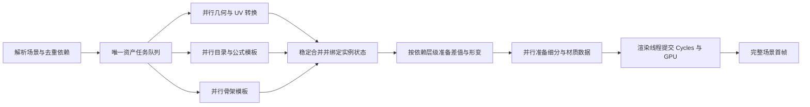

# 大场景加载与 60 秒目标调研

调研日期：2026-09-27。基线提交：`2af44ed`。用户目标为首次打开和再次打开都尽量在 60 秒内完成，默认保留模型、材质、细分、碰撞及渲染质量，以视口出现可交互的完整场景首帧为终点。

本文保留优化前的基线调查；后续实施与复测见[场景加载优化记录](scene_loading_optimization_cn.md)。

## 结论与范围

现有代码仍有明确的提速空间，需要结合减少重复工作、共享已解析的资产数据和有界并行。当前已经有后台加载、4 线程元数据预取、4 线程 Morph 差值补载、碰撞顶点并行，以及 Cycles 自己的贴图和 BVH 任务；仅将加载移到后台或增加线程数不能解决主要问题。

本轮交付调研、测量证据和复现工具，尚未实施产品加载算法改造，也未将 60 秒目标作为已实现结果。当前已部署的 历史验证的可执行文件 沿用原版本。

`17.duf` 当前已有缓存时的真实首帧约 215 秒，独立空应用缓存的 CPU 准备约 319 秒；`5b.duf` 与节点数排第二的 `9/1.duf` 还分别存在空网格和 TriAx 加载阻塞。因此“复杂度前几全部 60 秒”是需要同时解决性能和兼容性的工程目标，现有证据尚不足以保证能够全部达成。

## 测量口径

- 盘点 `H:/g1/Scenes` 下 42 个 DUF，包括子目录。这是当前项目使用的场景集合，不是对 `H:/g1` 全部产品目录中每个预设做加载排名。
- 四个内容库按 `DazFastViewer.project.json` 的原优先级使用。场景在 G1 不代表依赖全在 G1，部分头发和人物基础资产来自 G3 与公共库。
- CPU：Ryzen 7 5800X，8 核 / 16 线程；内存约 64 GiB；GPU：RTX 4070 Ti SUPER，16 GiB；H 盘为经 Realtek RTL9210B-CG USB 桥接的 SSD（由 `Get-Partition` / `Get-PhysicalDisk` 核对）。没有改变用户资源，也没有关闭其他程序或要求独占 GPU。
- “应用冷缓存”指使用独立空 `DFV_ASSET_CACHE`；未清空 Windows 文件缓存，也未清理驱动缓存。不能把它等同于开机后物理存储完全冷读。
- CPU 测量不含 Qt、Cycles 适配器细分、纹理解码上传、GPU BVH、真实首帧。UI 首帧另行测量；独立进程之间的阶段不可拼接成精确时间线。
- 新增 `--prepare-payloads` 对齐编辑器先批量请求差值、等待就绪后再首次求值的行为。旧诊断直接 `evaluate()`，通过逐项 `ensure()` 同步等待，不能据此认定编辑器的差值读取也是串行。
- `profile.json` 的父项包含子项；线程本地详细计时不收集后台工作线程，`metadata_prefetch` 为等待整个批次的墙钟时间。进程 CPU 时间含所有线程，不能与墙钟直接相加。
- 资源采样每秒一次；`read_bytes` 是 Windows 进程 I/O 计数，包含缓存路径，不等于实际物理盘读取量。`run.json` 的进程时长包含退出清理，首帧以 `events.csv` 为准。

## 样本选择

压缩 DUF 大小不足以代表复杂度。按节点数、几何条目、材质条目和解压文本分别筛选：

| 场景 | 节点 | 几何条目 | 材质条目 | 解压文本 MB | 代表的负载 |
| --- | ---: | ---: | ---: | ---: | --- |
| `17.duf` | 3,107 | 65 | 385 | 54.19 | 节点最多，多角色、多个大头发资产 |
| `9/1.duf` | 2,977 | 78 | 364 | 40.42 | 节点数第二，本轮发现 TriAx 兼容性阻塞 |
| `test9.duf` | 2,914 | 70 | 397 | 47.37 | 多角色及高渲染负载，既有渲染调研样本 |
| `12c.duf` | 2,871 | 84 | 422 | 52.24 | 多角色与较多材质，建议纳入最终回归 |
| `5b.duf` | 1,630 | 487 | 1,850 | 393.23 | 几何与材质条目最多，内嵌场景文档很大 |
| `TruForm/Grand Victorian Ballroom.duf` | 449 | 446 | 1,416 | 102.81 | 大量环境物件，建议纳入最终回归 |

这些是场景结构条目，含骨骼、附件和实例，不是人物数或唯一网格数。完整盘点见 `artifacts/load-investigation-20260927/scene-inventory.json`。

## 实测结果

### 正常编辑器：`17.duf`

已部署编辑器独立进程、默认应用缓存目录。应用缓存已被前一次 CPU 调研访问，因此这次属于缓存已使用的场景打开，不是应用冷缓存。

| 事件 / 阶段 | 秒 |
| --- | ---: |
| 文档交接触发相机事件 | 166.411 |
| 渲染会话创建 | 188.749 |
| Cycles 适配器准备结束 | 199.414 |
| 适配器准备自身耗时 | 10.665 |
| 第一次 Cycles 场景同步耗时 | 15.830 |
| 首次图像产出 | 215.331 |
| **首帧提交显示** | **215.460** |

文档交接到首帧为 **49.049 秒**，包含运行时、有效 Morph 差值、形变、细分、Cycles / GPU 和显示。不能把它全部叫作 GPU 耗时。`scene_sync` 与其他线程的选取索引准备可能重叠，不将所有事件时长简单相加。

这次保留了用户当时的配置：1,024 像素纹理上限、SSS 关闭、凹凸/法线开启、透明层数 16；实际渲染 267 × 250，视口 334 × 313。它能证明当前配置下明显超过 60 秒，**不能作为无限制纹理、默认大视口的首帧测量**。场景有 65 个实例、约 910.5 万渲染三角形；采样峰值工作集约 9.61 GiB、私有提交约 12.11 GiB，Cycles 报告 host-mapped 为 0。截图检查 PASS，测试进程正常退出。

证据：[首帧摘要](../artifacts/load-investigation-20260927/existing-cache-Scenes-17-ui-1/summary.json)、[事件时间线](../artifacts/load-investigation-20260927/existing-cache-Scenes-17-ui-1/events.csv)、[渲染配置](../artifacts/load-investigation-20260927/existing-cache-Scenes-17-ui-1/editor-render.json)、[运行记录](../artifacts/load-investigation-20260927/existing-cache-Scenes-17-ui-1/run.json)。

只改文档加载部分，即使乐观假定 166.411 秒均可获得 8 倍加速，其余 49.049 秒不变，仍需 **69.85 秒**。这是用实测阶段做的上限收益示意，未计并行开销，说明必须同时处理首帧前的准备链路。

### 原 CPU 诊断基线：`17.duf`

原诊断同步差值路径的总计为 **177.156 秒**，进程 CPU 时间约 197.797 秒，平均约占 1.12 个核。几何 / 材质 58.627 秒，Morph 发现 78.750 秒，骨架 11.213 秒，公式编译 1.651 秒，形变运行时构造 7.710 秒，首次形变 15.970 秒，其他工作约 3.235 秒。

几何阶段调用 `metadata_document` **16,788 次，合计 25.479 秒**；完整文档 JSON 解析 12.164 秒、读字节 5.725 秒。目录发现阶段两个 G8.1 Female 家族目录分别约 30.13 / 30.38 秒。共有 49,101 个实例参数、约 348.3 万基础顶点、384.4 万基础三角形。数据明显支持优先减少重复目录/元数据处理，而不是先归因于磁盘带宽或全场景碰撞。

其中一个头发的 UV 文件约 170.6 MB、几何文件约 209.4 MB，说明只看 6.76 MB 的场景 DUF 会严重低估工作量。这是逻辑文件规模，不是实测物理盘传输量。

本组未使用新增 `--prepare-payloads`，其首次形变包含同步差值等待，仅保留作工具校正和结果一致性对照。不能与 UI 结果相减来推导 GPU 时间。原始证据：[profile.json](../artifacts/load-investigation-20260927/17-current/profile.json)。

### 同版本 CPU 冷暖缓存对照：`17.duf`

使用此前不存在的 `isolated-cache-17` 目录，开启与编辑器一致的批量差值请求选项。CPU 准备总计 **318.673 秒**，其中几何 / 材质 **131.713 秒**、Morph 发现 **144.953 秒**、骨架 **17.915 秒**、运行时构造 **7.795 秒**、有效差值准备 **4.558 秒**、首次形变 **6.819 秒**。这还没有计入 Cycles 和 GPU 首帧。

随后以新进程、相同源码和配置、同一个应用缓存目录再次打开，CPU 准备为 **164.803 秒**。两次均完成，几何和有效权重哈希一致。

| CPU 阶段 | 空应用缓存（秒） | 应用缓存命中（秒） |
| --- | ---: | ---: |
| 几何 / 材质 | 131.713 | 49.102 |
| Morph 发现 | 144.953 | 76.763 |
| 骨架 | 17.915 | 11.505 |
| 公式编译 | 1.594 | 2.060 |
| 形变运行时构造 | 7.795 | 8.807 |
| 批量差值准备 | 4.558 | 4.228 |
| 首次形变 | 6.819 | 8.427 |
| **CPU 流程总计（含其他阶段）** | **318.673** | **164.803** |

单次样本中某些小阶段反而变慢，不能解释为冷缓存会加速这些阶段；线程调度、系统负载和分配状态会波动。这组对照说明现有缓存约减少 154 秒 CPU 流程墙钟时间，但缓存命中后的工作量仍不满足 60 秒目标。

几何阶段 Modifier 元数据中，源元数据解析调用 4,220 次，其中读字节合计 **43.635 秒**；同一次打开还发生 **12,433 次 CBOR 解码，17.431 秒**。总进程 CPU 时间约 **319.422 秒**，与墙钟近似，平均约一个核：既有冷资源读取等待，也有大量串行 CPU 准备，不能只归因于任意一方。

相对原同步诊断路径，65 个网格的位置哈希、65 组有效权重哈希、非零权重数、差值访问数和 Fit To 绑定数均一致。新增诊断选项没有通过改变变形结果缩短等待。证据：[冷缓存计时](../artifacts/load-investigation-20260927/isolated-Scenes-17-cpu-1/profile.json)、[一致性核对](../artifacts/load-investigation-20260927/cold-original-parity.json)。

缓存命中时，几何阶段依然做了 **16,653 次 CBOR 解码，15.642 秒**；两个 G8.1 Female 参数目录的主线程又分别做 7,086 次 CBOR 解码。优先级应是去重、持有预取句柄、共享目录模板，然后再扩大并发，而不是只把默认缓存做大。证据：[缓存命中计时](../artifacts/load-investigation-20260927/isolated-Scenes-17-cpu-2/profile.json)。

### 补充成功样本：`test9.duf`

默认应用缓存目录（已经过其他场景访问，不称为独立空缓存），使用批量差值请求选项，CPU 准备 **171.465 秒**，检查 PASS。几何 / 材质 **49.757 秒**、Morph 发现 **89.192 秒**、骨架 **12.288 秒**、运行时构造 **7.947 秒**、差值准备 **2.158 秒**、首次形变 **6.129 秒**。

共有 70 个对象参数目标，约 258.2 万基础顶点和 233.3 万基础三角形。几何阶段仍有 16,656 次 CBOR 解码，耗时 20.523 秒；相同类型的重复目录处理也出现在此场景，并非 `17.duf` 独有。本轮没有测它的真实 UI 首帧，不能把 171 秒称为打开到显示的总时间。证据：[CPU 计时](../artifacts/load-investigation-20260927/instrumented-Scenes-test9-cpu-1/profile.json)。

### 最大环境样本：`5b.duf` 当前加载失败

新增细粒度计时下，在 **138.770 秒**失败，错误为 `IR: 网格为空或没有材质槽`；失败发生在几何 / 材质阶段末尾校验，尚未进入 Morph、骨架与渲染。这不是“139 秒打开”，也不计为首帧成功样本。

| 几何阶段子项 | 秒 | 调用数 |
| --- | ---: | ---: |
| Modifier 设置处理（含其子项） | 86.247 | 10,851 |
| 其中：元数据视图 | 84.905 | 7,741 |
| 其中：磁盘 CBOR 读取 / 解码 | 56.456 | 7,685 |
| 几何构建（含读取 / 解析） | 15.182 | 484 |
| 材质转换（含依赖处理） | 11.130 | 1,850 |
| 初始 DUF 的 JSON 解析 | 8.833 | 1 |

这些是嵌套计时，表中行不能全部相加。单纯平滑设置发现已超过 60 秒，说明元数据读取组织方式值得优先改造；不能将“有 CBOR 缓存”视为已消除重复解析成本。

进一步只读解析原 DUF，定位到 `GoldenPalace_Shell` 引用内嵌 `geometry-8`：定义中的顶点数为 0、材质槽为空，但实例带有 `studio/geometry/shell` 标记以及 27 个材质组。现有加载器没有对应 Shell 分支，按普通网格导入后被 `Scene::validate()` 拒绝。这指向 Geometry Shell 兼容性缺失，需要正确恢复其依附几何和材质覆盖语义，不能简单删除空网格。具体证据：[内嵌几何与引用](../artifacts/load-investigation-20260927/5b-empty-geometries.json)。

证据：[失败报告与计时](../artifacts/load-investigation-20260927/instrumented-Scenes-5b-cpu-1/profile.json)、[运行记录](../artifacts/load-investigation-20260927/instrumented-Scenes-5b-cpu-1/run.json)。

### 节点数第二的样本：`9/1.duf` 当前加载失败

几何 / 材质 **50.909 秒**，Morph 发现 **67.788 秒**，随后骨架阶段报错：`此资产需要 TriAx，暂不支持该骨骼变换：Rope`，总计 **130.009 秒**到失败。没有获得该场景首帧，不将其作为成功加载样本。

几何阶段 Modifier 元数据耗时 28.159 秒，其中 15,362 次 CBOR 读取 / 解码耗时 18.947 秒。一个 G8.1 Female 目录在整批预取等待 3.118 秒之后，主线程仍做了 7,086 次 CBOR 解码（7.893 秒），说明“已并行预取”没有让串行消费阶段免除再次解码。另一个头发的预取独自等待 15.734 秒，反映不同资产家族的负载差异。

TriAx 属于已有能力边界；若“复杂度前几”必须包含该文件，就需要把兼容性实现纳入交付范围。将 Rope 隐藏或丢弃不算保留原场景的性能优化。证据：[失败报告](../artifacts/load-investigation-20260927/instrumented-9-1-cpu-1/profile.json)。

## 已确认的剩余瓶颈

### 元数据缓存命中后仍要进行大量工作

`src/daz/documents.cpp` 的磁盘缓存是 JSON 元数据的 CBOR 表示。每次进程重开仍需解码成 DOM，再由 `morphs.cpp` 解析地址、验证兼容、恢复引用、编译公式源及组装目录。缓存并未保存最终的类型化参数目录、骨架和几何。

`prefetch_documents()` 先启动最多 4 个线程，等待整批预取完成，再开始串行消费；预取结果通过约 192 MiB LRU 传递。大批次可能在消费前已淘汰前部文档，随后主线程再次解码。代码明确存在这一机制；若没有逐文件命中/淘汰计数，不能把所有主线程解码都归为预取失效。

优先改为有界窗口任务队列：预取任务返回有生命周期的不可变句柄，消费后释放；相同路径和视图合并在途请求。保留稳定的合并顺序和内容库优先级，并用字节预算限制同时解析的大文件数。

### 几何阶段重复解析路径和检查 Modifier

`loader.cpp` 的 `Repository::path()` 每次探测文件并规范化路径，`document()` 每次再次规范化。与 Morph 阶段不同，此处没有路径解析结果缓存。

为了找平滑参数，加载器会逐项解析没有 `channel` / `skin` 的场景 Modifier 引用。即使底层已有元数据缓存，重复文件状态查询、CBOR 解码和查找仍会发生。应按唯一资产先处理一次，并将类型化 Modifier 信息跨阶段共享，不能直接略过继承自基础资产的平滑设置。

大数组仍有按值访问，例如 UV 接缝、曲线资产的 `modifier_library`；多个阶段还复制场景子树。先改为有正确生命周期的引用，预分配数值缓冲区，并把顶点、UV、权重直接解析成连续类型化数据。`json::value()` 返回副本这一点可由 [nlohmann 官方 API 文档](https://json.nlohmann.me/api/basic_json/value/) 核对。

### 同族角色的目录和骨架尚未充分共享

`morphs.cpp` 以 `geometry_file + geometry_id` 缓存完整目录。`17.duf` 中普通 Genesis 8.1 Female 与内嵌派生几何各扫描一次约 7,086 份参数资源；已验证同拓扑的派生几何仍不能复用基础资产的完整目录构建结果。

可按兼容基础资产、拓扑指纹、源文件版本、内容库顺序和覆盖规则共享不可变目录/公式模板，再分别绑定实例的 Morph 值、别名、收藏和姿势。派生几何的局部参数覆盖须单独合并，不能仅按角色名称判定相同。

`skeleton.cpp` 逐对象构造骨架、权重及节点映射；权重校验用树容器，重复实例仍再次处理。可缓存经过验证的骨架/蒙皮模板，用连续标记数组检查重复索引，然后应用各实例的保存姿势。

### 并行边界应围绕独立资产及依赖层级

适合并行的工作：唯一 DSF/UV 文档的读取解析、唯一网格转换、独立角色家族的目录构建、不可变骨架模板、普通网格细分模板。合并到 `Scene`、分配稳定索引和操作 Cycles 场景节点仍由所属线程完成。

不能直接把现有对象循环替换为 `parallel_for`：它们共享 Repository、场景数组、报告、纹理/材质索引、缓存和公式符号表。主角 → 服装 → 附件、GeoGraft 及碰撞还有真实的先后依赖。建议按依赖图分层并行，在层末稳定合并，避免重复计算和浮点归约次序改变。

实施时应在本机用 1 / 4 / 6 / 8 个 CPU 工作线程做对照测试，另设低并发 I/O 队列；8 个物理核不等于能获得 8 倍端到端加速。限制并发大文档的总字节和暂存网格容量，避免与 PPL / Cycles 嵌套线程池争抢。Microsoft 对共享写入及阻塞并行循环的注意事项见 [PPL 最佳实践](https://learn.microsoft.com/en-us/cpp/parallel/concrt/best-practices-in-the-parallel-patterns-library?view=msvc-170)。



这是建议架构；任务结果为不可变资产块，队列同时限制任务数和内存，合并点负责稳定索引、异常传播与场景取消。

### 首帧后的 GPU 准备必须单独治理

`cycles/synchronize.inl` 仍串行准备部分细分/GeoGraft，并为需要按纹素密度推算凹凸强度的材质扫描场景三角形。可以先单遍汇总每材质的世界面积/UV 面积，复用图片头信息，避免材质数 × 三角形数的重复遍历。

Cycles 的 `scene/image.cpp` 已通过 `TaskPool` 读取图片，`scene/geometry.cpp` 已并行处理部分几何和 BVH；再次外包一层线程不是起点。应先拆出适配器、图片读取解码、设备上传、BVH、内核和首个样本的时间。16 GiB 显存下是否发生 host-mapped 分配也需要同时记录。

## 实施次序与 60 秒验收

| 优先级 | 工作 | 首次打开 | 再次打开 | 验收证据 |
| --- | --- | --- | --- | --- |
| P0 | 路径/Modifier 去重、消除大副本、同族目录共享、有界预取 | 直接受益 | 直接受益 | 文件操作与解码次数下降，结果哈希不变 |
| P1 | 独立几何、目录和骨架的任务图并行；连续权重结构 | 直接受益 | 直接受益 | 1/4/6/8 线程对照、峰值内存、任务关键路径 |
| P1 | 几何/UV/权重/公式直接解析到类型化结构 | 直接受益 | 直接受益 | 冷缓存解码、转换及分配耗时下降 |
| P2 | 类型化资产缓存、角色目录索引、版本化场景派生缓存 | 首次有生成成本 | 主要受益 | 独立空缓存与命中分别测，资源变化正确失效 |
| P2 | 细分模板复用/并行、材质面积单遍汇总、图片头信息复用 | 直接受益 | 直接受益 | 适配器与 Cycles 子阶段计时 |

用户要求首次也尽量达标，因此不能把“预先建好缓存”作为首次 60 秒达标条件。也不以降低纹理、隐藏对象、关闭碰撞或先展示未变形模型来替代当前画质的完整场景首帧。

类型化缓存应保存可验证的资产块，不保存整份可变编辑运行时。缓存身份至少包括内容库顺序、规范化源路径与文件版本、依赖版本、解析器/缓存格式版本、拓扑及 UV/细分条件；实例参数和姿势独立绑定。源资产更新、G8.1 空覆盖、内容库重排、坏缓存和 DUFEX 修改都需要正确失效或局部重建。

建议将 60 秒作为明确的阶段预算：文档与资源准备不超过 30 秒，初始依赖/形变不超过 10 秒，细分/适配器/Cycles/GPU 与首帧不超过 15 秒，保留 5 秒余量。**这是工程预算，不是已验证的时间预测。** 若某场景在保留完整内容和精度时单独 GPU 阶段就超过预算，应如实记录该场景未达标。

每个候选场景至少做 3 次独立应用冷缓存、5 次应用缓存命中，以实际首帧而非 CPU 结束计时，同时报告中位数、最大值和资源峰值；后续持续收集足够样本再计算 P95。核对对象/材质/参数数、有效权重与变形顶点哈希、实例隔离、GeoGraft 接缝、衣服跟随、保存姿势、DUFEX 恢复，以及资源变更/缺失/失败时的缓存失效。

本轮每种实际条件只有一次测量，足以定位明显超时与重复工作，不是上述未来验收的多次统计，也不是整库最快/最慢排名。没有取得独立空缓存的 UI 首帧、默认最高画质的大视口首帧或全部候选场景的成功结果；首次 60 秒和再次 60 秒均尚未完成验收。

## 本轮改动与验证

- `src/daz/documents.cpp` / `loader.cpp` 仅增加默认关闭的阶段计时，区分源文档、CBOR、预取、路径、材质、节点、几何及 Modifier；正常产品不启用采集。
- `tools/profile_load.cpp` 增加可选 `--prepare-payloads`，保留旧同步路径，并拒绝未知选项。
- `tools/investigate_scene_load.py` 提供只读场景盘点、顺序测量、可隔离的应用缓存、进程 CPU/内存/I/O 采样及失败/超时记录。失败运行返回非零退出码。
- Release 诊断目标构建成功。五项相关 CTest：`scene_ir_dson`、`morph_catalog`、`skeleton_pose`、`formula_runtime`、`lazy_morph` 全部通过，见 [CTest 日志](../artifacts/load-investigation-20260927/ctest.log)。
- Python 语法检查、既有有效/损坏 DUF 夹具盘点、缺失输入失败退出检查通过。`17.duf` 三条诊断路径的几何/权重结果一致，见 [三次结果核对](../artifacts/load-investigation-20260927/all-17-parity.json)。
- 汇总数据：[CPU 测量摘要](../artifacts/load-investigation-20260927/cpu-summary.json)。测量未改写用户的 DUF/DSF；未部署优化版编辑器或创建 Git 提交。

## 复现工具

```powershell
python tools/investigate_scene_load.py inventory H:/g1/Scenes artifacts/my-load-inventory.json

$cmake = 'C:/Program Files/Microsoft Visual Studio/2022/Community/Common7/IDE/CommonExtensions/Microsoft/CMake/CMake/bin/cmake.exe'
& $cmake --build build --config Release --target SceneLoadProfile --parallel 6

# 使用尚不存在的缓存目录：第 1 次是应用冷缓存，第 2 次缓存命中。
python tools/investigate_scene_load.py measure H:/g1/Scenes/17.duf --kind cpu `
  --output artifacts/my-load-measure --cache artifacts/my-new-cache --repeats 2

# 正常已部署编辑器的完整场景首帧，保留用户当前渲染配置，副屏运行。
python tools/investigate_scene_load.py measure H:/g1/Scenes/17.duf --kind ui `
  --output artifacts/my-ui-measure
```

采样脚本的 `measure` 需要当前 Python 环境已有的 `psutil`，`inventory` 只需标准库。每次输出目录必须不存在，防止混入旧证据。工具超时只终止自己启动的诊断进程。修改仅增加默认关闭的诊断计时与可选诊断参数，没有改变常规加载算法。
